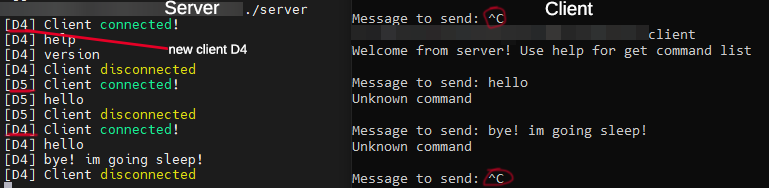
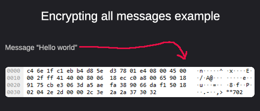

# FastCppClientServer
**MultiPlatform fast multithread with encrypted communication client-server on C++**



**Example of encryption (Based on DH)**



**Build**

1. **```cmake -G "MinGW Makefiles" .```** // for windows **```cmake .```** // for linux

2. **```cmake --build .```**


* tested on C++ 13
